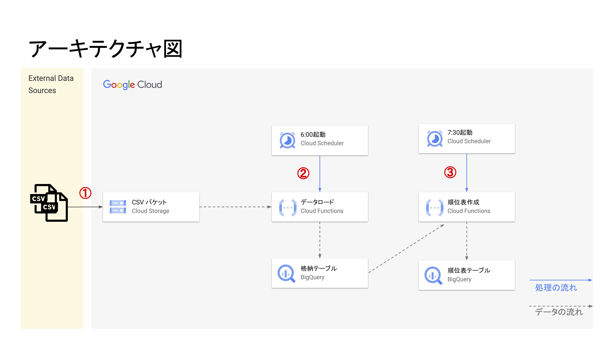

# オンボーディング データ分析基盤構築課題

## 概要
分析基盤システム（メジャーリーグ順位表システム）を構築します。
- 毎日メジャーリーグに出場したホームチームとアウェーチームの戦績データを `BigQuery` にロードします。
- ロードしたデータに対し、順位表を作成します。
- 以上の操作を定期的に自動で実行されることを目的としています。

## 要件
[こちら](https://docs.google.com/spreadsheets/d/1SB-XIxQGWG7oaGQYi94XsxQHl22nDTDknOju_5f9KQQ/edit#gid=287184081)を参照してください。

## 成果物
### アーキテクチャ図

① CSVファイル は、外部システムが毎日午前 6 時までに `Cloud Storage` にアップロードされます。

②毎日午前 6 時、`Cloud Scheduler` が HTTP リクエストトリガーとして、データロード関数（`load_data Functions`）を呼び出します。
データは `Cloud Storage` から `BigQuery` にロードされ、`csv_from_gcs` テーブルに格納されます。

③毎日午前 7 時 30 分、`Cloud Scheduler` が HTTP リクエストトリガーとして、順位表作成関数（`analyse-data Functions`）を呼び出します。
`csv_from_gcs` テーブルに存在するデータの順位を示された結果は `BigQuery` の `standings_from_functions` テーブルに格納されます。

### ドキュメント
[こちら](https://docs.google.com/spreadsheets/d/1046TqE0tv1MICqUCmBnfw0Wj_rT7M5aVzOcFbsSIoD4/edit#gid=35006606)を参照してください。
- 機能設計
- テーブル定義
- パラメータシート
- テスト仕様書
- タスク一覧

## ディレクトリ構成
<pre>
.
├── README.md
├── cloud_functions
│   ├── data_analysis
│   │   ├── bigquery.sql
│   │   ├── main.py
│   │   └── requirements.txt
│   └── data_load
│       ├── main.py
│       ├── requirements.txt
│       └── schema.json
├── csv_data
│   ├── awayTeam_data
│   │   ├── Angels_20160701.csv
│   │   ├── Cubs_20160701.csv
│   │   ├── Giants_20160701.csv
│   │   ├── Indians_20160701.csv
│   │   ├── Marlins_20160701.csv
│   │   ├── Orioles_20160701.csv
│   │   ├── Reds_20160701.csv
│   │   ├── Royals_20160701.csv
│   │   └── Tigers_20160701.csv
│   └── homeTeam_data
│       ├── Athletics_20160701.csv
│       ├── Blue Jays_20160701.csv
│       ├── Braves_20160701.csv
│       ├── Mariners_20160701.csv
│       ├── Mets＿20160701.csv
│       ├── Nationals_20160701.csv
│       ├── Phillies_20160701.csv
│       ├── Rays_20160701.csv
│       └── Red Sox_20160701.csv
└── img
    └── Architect.jpg

8 directories, 26 files
</pre>

`README` や画像フォルダ `img` を除く、`cloud_functions` と `csv_data` というフォルダが存在します。
- cloud_functions : ソースコードフォルダ
    - data_analysis : `analyse-data` 関数のソースコード、環境ファイルや実行する `sql` ファイル
    - data_load : `load_data` 関数のソースコード、環境ファイルやスキーマを記載する `json` ファイル
- csv_data : テスト用 `CSV` データフォルダ
    - `homeTeamName` または `awayTeamName` に分かれています。

## 今後の課題
1. データ退避機能を実装する
2. 1.ができたら、データの書き込みを`APPEND`に変更する
3. workflow を使ってみる
4. 障害発生時の復旧を考える
